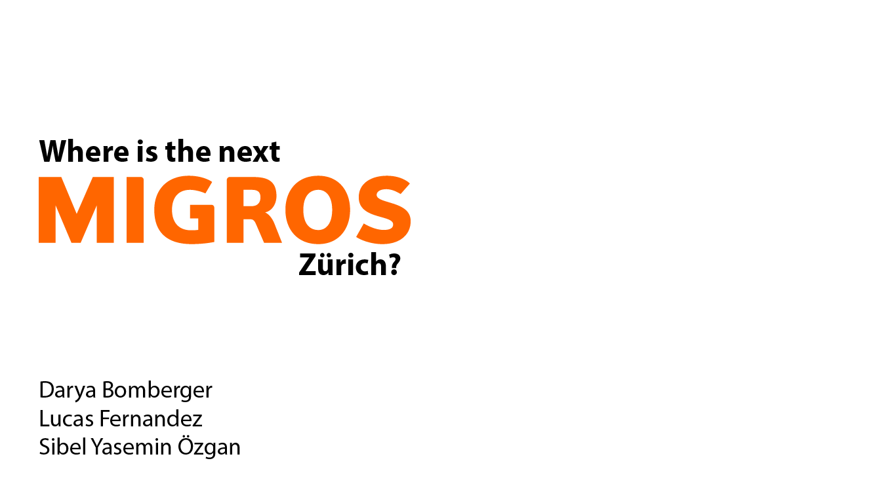

# Migros_Development_Strategy

#### -- Project Status: [Completed]

## Project Intro/Objective
The purpose of this project is to find out the best locations for the future Migros Stores in Zürich.
Analyzes market opportunities based on the density of existing stores, presence of competitors, and general population density to inform Migros’ development strategy.

### Partner
* [SIT Academy](https://sit.academy/)

### Methods Used
* Inferential Statistics
* Exploratory Data Analysis
* Data Visualization

### Technologies
* Python
* Pandas, jupyter
* Google API, Zürich Tourism API

## Project Description

- Data Gathering: Google Places API, Zürich Tourism API, Open Data Zürich, proprietary data from UrbanDataLab.
- Data Preparation and Understanding: Pandas 
- Data Visualization: Plotly

## Getting Started

1. Clone this repo (for help see this [tutorial](https://help.github.com/articles/cloning-a-repository/)).
2. Raw Data is being kept [here](Repo folder containing raw data) within this repo.

    *If using offline data mention that and how they may obtain the data from the froup)*

3. Data processing/transformation scripts are being kept [here](Repo folder containing data processing scripts/notebooks)
4. etc...

*If your project is well underway and setup is fairly complicated (ie. requires installation of many packages)
create another "setup.md" file and link to it here*

5. Follow setup [instructions](Link to file)

## Featured Notebooks/Analysis/Deliverables
* [Notebook](notebooks/google_api.ipynb)
* [Notebook](notebooks/visualization.ipynb)
* [Notebook](notebooks/vegan_restaurants_notebook.ipynb)
* [Notebook](notebooks/Zürich_Tax_Incomes.ipynb)
* [Presentation](reports/Presentation-reduced.pdf)

## Contributing Members

**Team Leads (Contacts) : 
- [Darya Bomberger](https://github.com/dbomberger)**
- [Lucas Fernandes](https://github.com/LucR31)**
- [Sibel Yasemin Özgan](https://github.com/sibelyozgan)**

